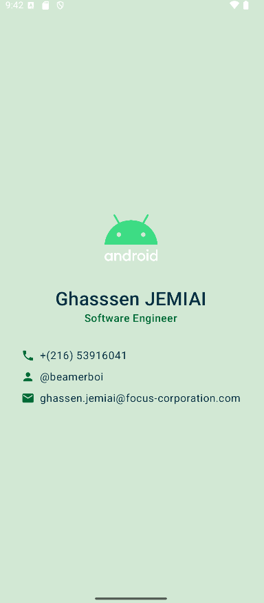

# Jetpack Compose Business Card App

## Academic Project Information
- **Author:** Ghassen JEMIAI
- **Class:** INGTA-2C
- **Academic Year:** 2024/2025
- **Subject:** Mobile Development

## Project Description
This project is a business card application developed using Jetpack Compose for Android. The app demonstrates the implementation of various UI components and layouts in Jetpack Compose to create a digital business card.

## Features
- Displays user information in a clean, organized layout
- Shows profile picture/logo
- Presents contact information (phone, email, etc.)
- Implements proper spacing and alignment using Jetpack Compose

## Technologies Used
- Kotlin
- Jetpack Compose
- Android Studio

## Screenshots

## Setup and Installation
1. Clone this repository
2. Open the project in Android Studio
3. Build and run the application on an emulator or physical device

## Project Structure
- `MainActivity.kt`: Entry point of the application

## Academic Context
This project was developed as part of the Mobile Development course requirement for the academic year 2024/2025. It demonstrates proficiency in modern Android development practices using Jetpack Compose.

---

*Note: This project is submitted for academic evaluation purposes.* 